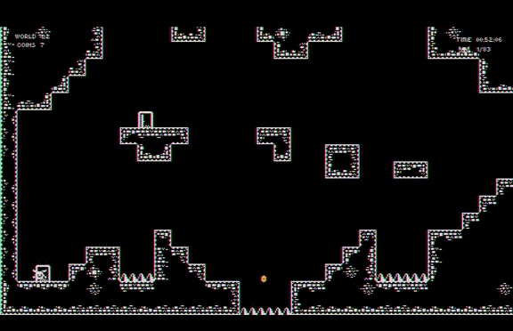
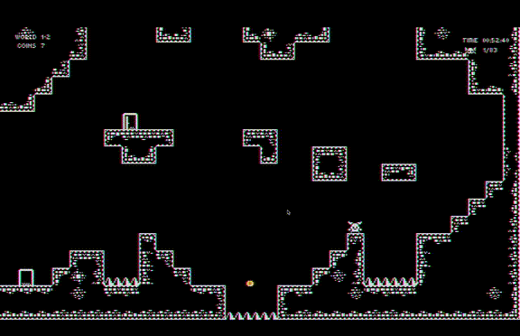
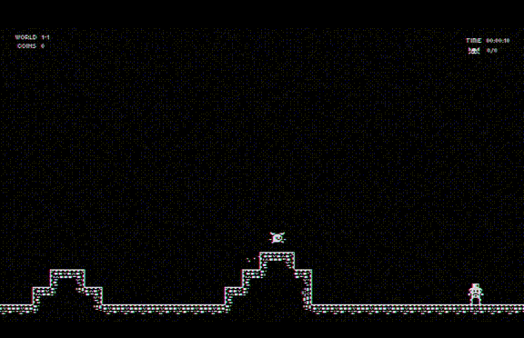
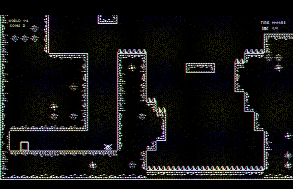
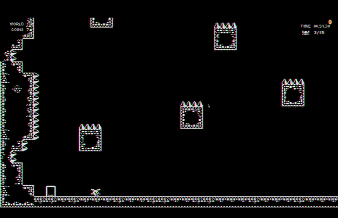
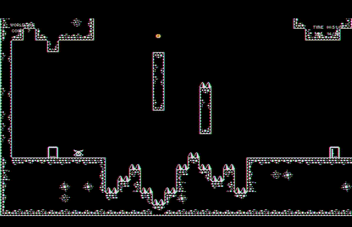
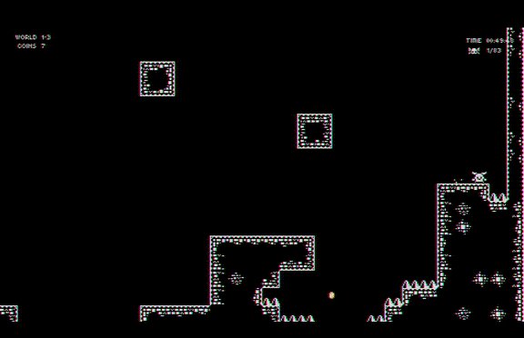

# Find The Door

**Find The Door** is a challenging **2D platformer** inspired by iconic titles like _Celeste_, _Super Meat Boy_, with a unique twist reminiscent of _Super Metroid_. The game blends tight, responsive controls with complex environmental puzzles, creating a deeply engaging platforming experience.

### Technical Features and Game Mechanics:

- **Engine and Development Tools**: Developed in the Godot Engine and managed with git for version control, ensuring robust development workflows.
- **Design**: Features comprehensive level, narrative, and art design, providing a rich gaming experience.
- **Testing**: Extensively playtested to fine-tune difficulty levels and refine gameplay mechanics for a balanced challenge.
- **Visuals and Audio**: Utilizes shaders and particle effects to enhance visual appeal, complemented by a dynamic sound system for an immersive audio experience.
- **Physics and Mechanics**: Advanced physics engine supports intricate mechanics such as dashing, wall jumping, grappling, and more.
- **Interactive Environments**: Includes moving platforms, spring jumps, and other dynamic elements to challenge players.
- **Persistence**: Features a robust save/load system alongside in-game collectibles to enhance player engagement.
- **Content Rich**: Offers engaging dialogues and cut-scenes, numerous power-ups, and over 20 meticulously designed levels.

### Quality of Life Enhancements:

- **Coyote Time**: Allows for a brief window to jump after leaving a platform, enhancing gameplay forgiveness.

  

    
  

- **Corner Correction Dash**: Adjusts player trajectory when dashing near corners, improving movement fluidity.

  

    
  

- **Jump Buffering**: Captures jump inputs just before landing, enabling immediate response for seamless control.

  

    
  

### Gameplay Experience:

Venture into the mystic realms of **Find The Door**. Navigate a labyrinth of intricate obstacles in your quest to unlock the legendary Door of Desires.

- **Key Characters**: Meet your guides, the quirky Zezinho and the enigmatic Guardian, who will challenge and assist you.

  

    
    
  

- **Core Skills**: Master essential platforming skills such as dashing and wall jumping to advance through challenging environments.

  

    
    
  

- **Grappling Hook**: Utilize this tool to discover new strategies and navigate the environment.

  

    
    
  

- **Dynamic Challenges**: Face dynamic obstacles and refine your movements for precision gameplay.

  

    
    
  

- **Skill Synthesis**: Combine all learned skills in complex scenarios to navigate the most demanding parts of the game. Discover and master Super Dashes to expand your ability to explore and conquer diverse landscapes.

  

    
    
  

  

    
    
  

Embark on this thrilling adventure in **Find The Door**, where each challenge is a key to unraveling the grand mystery behind the legendary Door of Desires.
