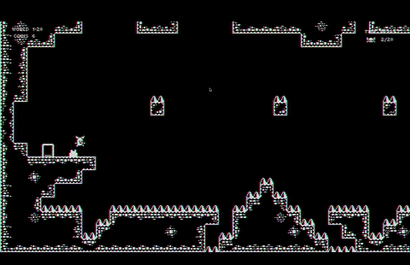

<!-- [Link to another page](./another-page.html). -->

# Find The Door 

Find the Door is a **2D hard platformer** inspired by the likes of Celeste, Super Meat Boy and a little touch of Super Metroid.

The technical aspect of the game includes:

- Built using Godot + git for version control
- Level design, narrative design and art design
- Playtested multiple times by different players to adjust difficulty and refine gameplay
- Shaders and particles for enchancing the visual appeal
- Dynamic sound to enrich the gameplay
- Physics system with the use of power-ups, e.g. dash, wall jump, super wall jump, super dash, grappling hook, etc.
- Physics system integrated with external objects, e.g. moving platforms, spring jumps, falling platforms, etc.
- Saving/loading system
- In-game collectables
- Cut-scenes, dialogues, power-ups, 20+ levels and many more

### The game itself

Venture into the mystic realms of **Find The Door**, a 2D platformer filled with complex puzzles and evolving challenges. As a seeker, navigate a labyrinth of intricate obstacles in your quest to unlock the legendary Door of Desires. Here's a glimpse of the adventure that awaits!

  
  

---

Encounter Zezinho, your cryptic yet humorous guide, and the Guardian, the enigmatic overseer who will test your resolve at every turn.

  
  

---

Master essential platforming skills such as Dashes and Wall Jumps to navigate through the game's demanding environments.

  
  

---

Explore further with the twist of a Grappling Hook, adding a layer of strategy and precision to your toolkit.

  
  

---

Tackle dynamic obstacles and refine your movements for precision gameplay.

  
  

---

Synthesize your skills in challenging scenarios that require everything you’ve learned.

  

Embark on this enthralling journey where each step unlocks a part of the grand mystery of the Door of Desires.
