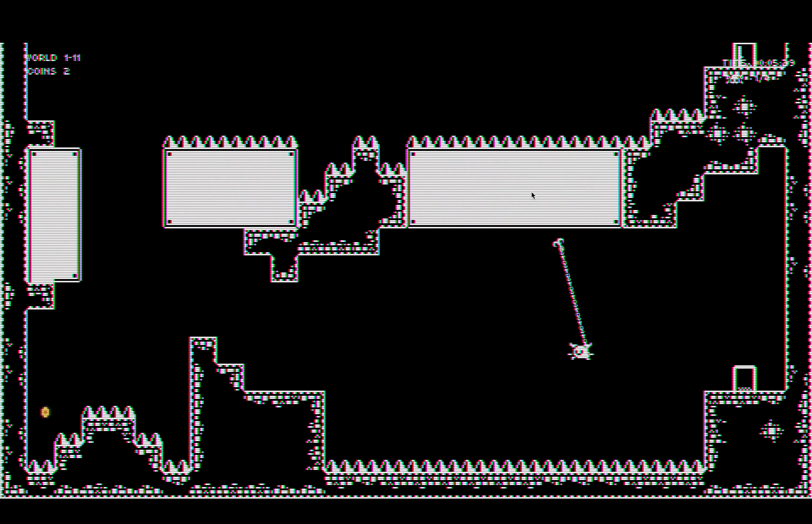

# Find The Door

**Find The Door** is a challenging **2D platformer** inspired by iconic titles like _Celeste_, _Super Meat Boy_, with a unique twist reminiscent of _Super Metroid_. The game blends tight, responsive controls with complex environmental puzzles, creating a deeply engaging platforming experience.

For a playable version, visit: [https://github.com/jonckjunior/portfolio](https://github.com/jonckjunior/portfolio)

### Technical Features and Game Mechanics:

- **Engine and Development Tools**: Developed in the Godot Engine and managed with git for version control, ensuring robust development workflows.
- **Design**: Features comprehensive level, narrative, and art design, providing a rich gaming experience.
- **Testing**: Extensively playtested to fine-tune difficulty levels and refine gameplay mechanics for a balanced challenge.
- **Visuals and Audio**: Utilizes shaders and particle effects to enhance visual appeal, complemented by a dynamic sound system for an immersive audio experience.
- **Physics and Mechanics**: Advanced physics engine supports intricate mechanics such as dashing, wall jumping, grappling, and more.
- **Interactive Environments**: Includes moving platforms, spring jumps, and other dynamic elements to challenge players.
- **Persistence**: Features a robust save/load system alongside in-game collectibles to enhance player engagement.
- **Content Rich**: Offers engaging dialogues and cut-scenes, numerous power-ups, and over 20 meticulously designed levels.

### Quality of Life Enhancements:

- **Coyote Time**: Allows for a brief window to jump after leaving a platform, enhancing gameplay forgiveness.

  <!-- 

    
  
 -->

- **Corner Correction Dash**: Adjusts player trajectory when dashing near corners, improving movement fluidity.

  <!-- 

    
  
 -->

- **Jump Buffering**: Captures jump inputs just before landing, enabling immediate response for seamless control.

  <!-- 

    
  
 -->

### Gameplay Experience:

Venture into the mystic realms of **Find The Door**. Navigate a labyrinth of intricate obstacles in your quest to unlock the legendary Door of Desires.

- **Key Characters**: Meet your guides, the quirky Zezinho and the enigmatic Guardian, who will challenge and assist you.

  

    
    
  

- **Core Skills**: Master essential platforming skills such as dashing and wall jumping to advance through challenging environments.

  

    
    
  

- **Grappling Hook**: Utilize this tool to discover new strategies and navigate the environment.

  

    
    
  

- **Dynamic Challenges**: Face dynamic obstacles and refine your movements for precision gameplay.

  

    
    <!--  -->
  

- **Skill Synthesis**: Combine all learned skills in complex scenarios to navigate the most demanding parts of the game. Discover and master Super Dashes to expand your ability to explore and conquer diverse landscapes.

  

    
    <!--  -->
  

  <!-- 

    
    
  
 -->

Embark on this thrilling adventure in **Find The Door**, where each challenge is a key to unraveling the grand mystery behind the legendary Door of Desires.

# Code Conquerors

**Code Conquerors** is an innovative **competitive programming simulation** game inspired by the strategic planning and problem-solving aspects of competitive coding environments like Codeforces and TopCoder. In this simulation, players manage a team of coders, each represented as pawns, in real-time coding battles against AI teams.

This is still a WIP, so there's no playable version yet!

### Technical Features and Game Mechanics:

- **Engine and Development Tools**: Developed with the Godot Engine and integrated with git for version control, ensuring efficient management and iterative enhancements.
- **Game Design**: Features detailed management mechanics including team formation, strategy planning, and real-time decision-making.
- **Testing and Balancing**: Rigorously tested to balance the difficulty and ensure a realistic competitive environment that mimics actual programming contests.
- **Visuals and Animation**: Utilizes a unique "scribble boiling line" aesthetic that brings a dynamic and visually engaging look to the coding process.
- **Audio Design**: Incorporates dynamic sounds that enhance the atmosphere, with auditory cues that signal success, failure, and competitive tension.
- **Simulation Mechanics**: Includes an elo-based ranking system, real-time problem-solving simulation, and various coding steps like problem reading, solution planning, and coding.
- **Interactive Challenges**: Features interactive problem boards where players can drag and drop coders to tackle specific problems, with varying degrees of difficulty based on the problem’s and coder’s elo.
- **Persistence and Progression**: Offers a save/load system and an ongoing leaderboard that reflects the team’s performance over time.
- **Dynamic Content**: Includes a variety of problems, real-time standing updates, and interactive elements like 'game juice' notifications for solved problems.

### Quality of Life Enhancements:

- **Step Retry System**: Allows coders to retry specific steps of problem-solving upon failure.
- **Dynamic Difficulty Adjustment**: Automatically adjusts the complexity of contests based on the team's current performance, ensuring a challenging yet fair gameplay experience.

### Gameplay Experience:

Step into the competitive world of **Code Conquerors**. Manage your team of skilled programmers through various stages of a coding contest, strategizing the best approaches to complex algorithmic problems.

- **Real-Time Strategy and Management**: Organize your team, assign problems based on coder’s strengths, and adjust strategies on the fly to outmaneuver competing teams.

  

    
  

- **Elo Progression System**: Watch your coders improve through each successfully solved problem, enhancing their abilities and your team’s overall ranking.

- **Engaging Problem Solving**: Each coder must navigate through reading, solving, and coding phases, with each phase offering unique challenges.

- **Competitive Elements**: Compete against AI-driven teams, observe real-time standings, and experience the thrill of climbing up the leaderboard.

  

    
  

Embark on this unique journey in **Code Conquerors**, where strategic management, real-time decision making, and problem-solving skills are key to dominating the world of competitive programming.
